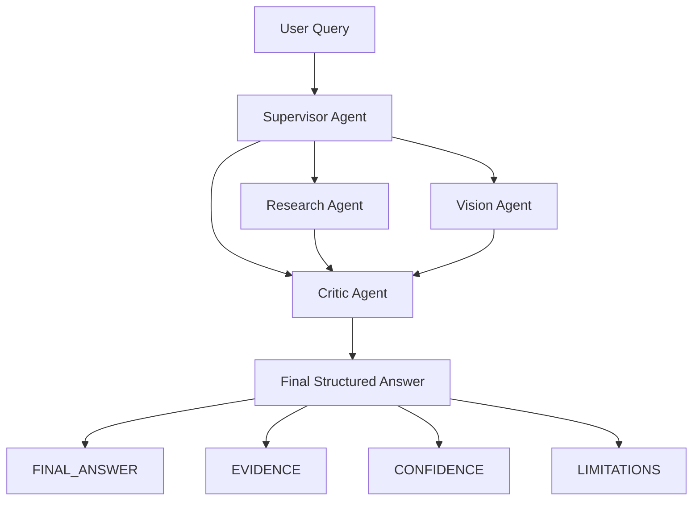

# Visual Multi-Agent AI (Research + Vision + Critic)

Dự án này trình bày một hệ thống đa tác tử (multi-agent) cho bài toán hỏi đáp kết hợp:
- Nghiên cứu thông tin (research)
- Phân tích hình ảnh (vision)
- Kiểm định/tổng hợp kết quả (critic)

Hệ thống được xây dựng trên LangGraph + LangChain và sử dụng mô hình Gemini qua Google API.

## Mục tiêu dự án

- Tự động điều phối câu hỏi đến đúng agent chuyên môn.
- Xử lý truy vấn text, image, hoặc truy vấn kết hợp text + image.
- Tổng hợp câu trả lời cuối có cấu trúc rõ ràng và thể hiện độ tin cậy.

## Kiến trúc tổng quan

1. Research Agent
- Nhiệm vụ: tìm kiếm kiến thức, bài báo, tổng hợp nền tảng lý thuyết.
- Tool chính: Arxiv, Wikipedia.

2. Vision Agent
- Nhiệm vụ: mô tả hình ảnh, detect/count object.
- Tool chính: image_describer_tool, detect_and_count_object_tool (YOLO).

3. Critic Agent
- Nhiệm vụ: đối chiếu kết quả từ các agent khác và tổng hợp final answer.
- Định dạng output mục tiêu:
  - FINAL_ANSWER
  - EVIDENCE
  - CONFIDENCE
  - LIMITATIONS

4. Supervisor Agent
- Điều phối 3 agent theo routing policy.
- Không tự làm domain work, chỉ orchestration.
- Yêu cầu critic_agent ở bước tổng kết cuối.

### Sơ đồ điều phối (Supervisor -> Agent con)

## Công nghệ sử dụng

- Python + Jupyter Notebook
- LangChain / LangGraph
- langgraph-supervisor
- Gemini (Google Generative AI)
- Ultralytics YOLO

## Cấu trúc workspace

- AI-Multi_Agent-Image.ipynb: notebook chính (setup, tools, agents, inference).

## Hướng dẫn chạy nhanh

1. Cài thư viện trong các cell setup đầu notebook.
2. Cấu hình biến môi trường API key:
- LANGCHAIN_API_KEY
- TAVILY_API_KEY
- GOOGLE_API_KEY
3. Khởi tạo llm (Gemini).
4. Chạy lần lượt các cell tạo tool/agent.
5. Chạy cell supervisor và các cell inference.

## Lưu ý quan trọng

1. Quota Gemini Free Tier
- Có thể gặp lỗi 429 ResourceExhausted khi vượt hạn mức.
- Cách xử lý: đổi model nhẹ hơn, đổi project/key, hoặc chờ đến kỳ reset quota.

2. Bảo mật API key
- Không hard-code key trong bản public.
- Khuyến nghị dùng file .env và bổ sung .env vào .gitignore.

3. Tương thích phiên bản package
- Notebook có nhiều package liên quan LangChain/LangGraph.
- Nếu gặp lỗi import/signature, cần đồng bộ version theo bộ package đang dùng.

## Định hướng mở rộng

- Bổ sung memory state giữa các phiên hỏi đáp.
- Thêm evaluator benchmark (factuality, latency, tool-use success).
- Tích hợp thêm retrieval tool cho tài liệu nội bộ.

## Reference

- AI VietNam 

---

